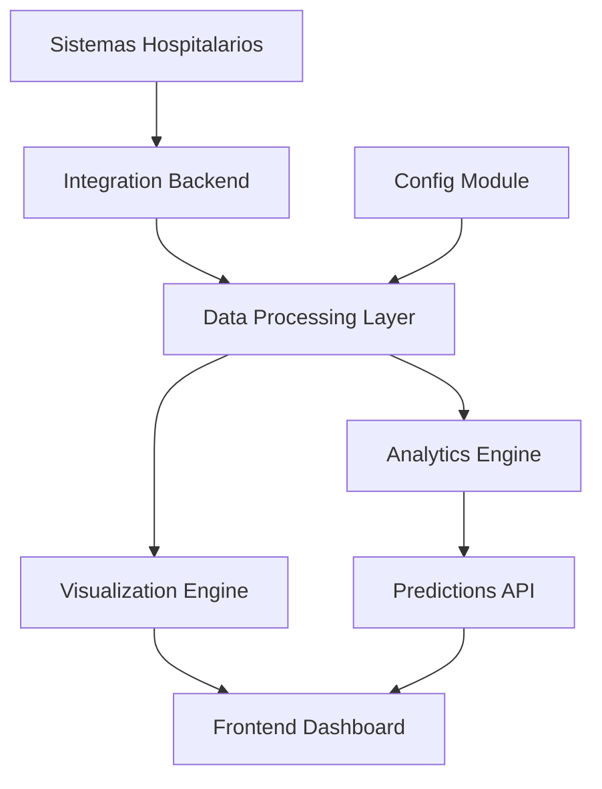

# Arquitectura del Sistema

## Visión General

La plataforma Patient Journey Predictor está diseñada como un sistema modular y escalable que integra múltiples componentes para la predicción inteligente de recursos médicos.

## Componentes Principales

### 1. Módulo de Configuración (`config-module`)

**Responsabilidades:**
- Gestión de parámetros por especialidad médica
- Configuración de recursos por centro de salud
- Definición de flujos de pacientes
- Mapeo de códigos ICD-10 y CPT

**Tecnologías:**
- Python + FastAPI
- Base de datos: MySQL
- API RESTful

**Estructura:**
```
config-module/
├── controllers/
│   ├── specialtyController.js
│   ├── resourceController.js
│   └── flowController.js
├── models/
│   ├── Specialty.js
│   ├── Resource.js
│   └── PatientFlow.js
├── routes/
└── services/
```

### 2. Backend de Integración (`integration-backend`)

**Responsabilidades:**
- Conectar con APIs de sistemas hospitalarios
- Sincronización de datos de laboratorios
- Gestión de citas y referencias
- Procesamiento de imágenes médicas

**Conectores:**
- **Laboratorios**: HL7 FHIR, LIS (Laboratory Information System)
- **Imágenes**: DICOM, PACS (Picture Archiving and Communication System)
- **Citas**: Sistemas de agendamiento
- **Referencias**: Sistemas de derivación

**Tecnologías:**
- Python + FastAPI
- WebSockets para tiempo real
- Message Queue (Redis/Celery)
- API Gateway

### 3. Motor de Visualización (`visualization-engine`)

**Responsabilidades:**
- Renderizado de gráficos interactivos
- Dashboards en tiempo real
- Mapas de calor de recursos
- Flujos de pacientes

**Tecnologías:**
- React + TypeScript
- D3.js para visualizaciones complejas
- Chart.js para gráficos estándar
- WebGL para renderizado de alto rendimiento

**Componentes:**
- PatientFlowDiagram
- ResourceHeatmap
- RealTimeDashboard
- AnalyticsCharts

### 4. Motor de Analítica (`analytics-engine`)

**Responsabilidades:**
- Análisis predictivo de recursos
- Machine Learning para patrones
- Optimización de capacidades
- Alertas proactivas

**Tecnologías:**
- Python + FastAPI
- Scikit-learn, TensorFlow
- Pandas, NumPy
- Jupyter Notebooks

**Modelos:**
- Predicción de demanda por especialidad
- Optimización de recursos
- Detección de anomalías
- Clustering de pacientes

## Flujo de Datos



## Base de Datos

### Esquema Principal

```sql
-- Centros de Salud
CREATE TABLE health_centers (
    id VARCHAR(36) PRIMARY KEY,
    name VARCHAR(255),
    type VARCHAR(100), -- hospital, clinic, policlinic
    specialties JSON,
    resources JSON
);

-- Especialidades
CREATE TABLE specialties (
    id VARCHAR(36) PRIMARY KEY,
    name VARCHAR(255),
    common_tests JSON,
    typical_medications JSON,
    icd10_codes JSON
);

-- Flujos de Pacientes
CREATE TABLE patient_flows (
    id VARCHAR(36) PRIMARY KEY,
    specialty_id VARCHAR(36),
    flow_steps JSON,
    average_duration INTEGER,
    resource_requirements JSON,
    FOREIGN KEY (specialty_id) REFERENCES specialties(id)
);

-- Datos de Interacciones
CREATE TABLE patient_interactions (
    id VARCHAR(36) PRIMARY KEY,
    patient_id VARCHAR(255),
    center_id VARCHAR(36),
    specialty_id VARCHAR(36),
    interaction_type VARCHAR(100),
    timestamp TIMESTAMP,
    data JSON,
    FOREIGN KEY (center_id) REFERENCES health_centers(id),
    FOREIGN KEY (specialty_id) REFERENCES specialties(id)
);
```

## APIs Principales

### Configuración
- `GET /api/specialties` - Listar especialidades
- `POST /api/specialties` - Crear especialidad
- `PUT /api/specialties/:id` - Actualizar especialidad
- `GET /api/centers` - Listar centros
- `POST /api/centers` - Crear centro

### Integración
- `POST /api/integration/laboratory` - Sincronizar datos de laboratorio
- `POST /api/integration/imaging` - Sincronizar imágenes
- `GET /api/integration/appointments` - Obtener citas
- `POST /api/integration/referrals` - Gestionar referencias

### Analítica
- `GET /api/analytics/predictions` - Obtener predicciones
- `POST /api/analytics/analyze` - Ejecutar análisis
- `GET /api/analytics/dashboard` - Datos del dashboard
- `GET /api/analytics/reports` - Generar reportes

### Visualización
- `GET /api/visualization/flows` - Datos de flujos
- `GET /api/visualization/heatmap` - Datos de mapa de calor
- `GET /api/visualization/realtime` - Datos en tiempo real

## Seguridad

### Autenticación
- JWT tokens
- OAuth 2.0 para integraciones
- API keys para sistemas externos

### Autorización
- Roles basados en permisos
- RBAC (Role-Based Access Control)
- Audit logs

### Protección de Datos
- Encriptación en tránsito (HTTPS/TLS)
- Encriptación en reposo
- Cumplimiento HIPAA/GDPR
- Anonimización de datos

## Escalabilidad

### Horizontal Scaling
- Load balancers
- Microservicios
- Containerización (Docker)
- Orquestación (Kubernetes)

### Performance
- Caché distribuido (Redis)
- CDN para assets estáticos
- Optimización de consultas
- Índices de base de datos

## Monitoreo

### Métricas
- Performance de APIs
- Uso de recursos
- Errores y excepciones
- Tiempo de respuesta

### Logging
- Structured logging (JSON)
- Log aggregation (ELK Stack)
- Alertas automáticas
- Dashboards de monitoreo

## Deployment

### Desarrollo
- Docker Compose
- Hot reload
- Debugging tools

### Producción
- Kubernetes
- CI/CD pipelines
- Blue-green deployment
- Rollback automático
